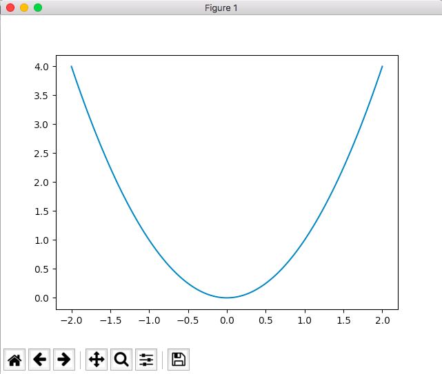

#### 【matplotlib】グラフを書く
##### 前提
- なし
---
##### 0. 環境
- python 3.6.3
- [pip] numpy 1.13.3
- [pip] matplotlib 2.1.0

##### 1. 最も簡単なグラフ描写

なにはともあれ、まず書いてみる。

```python
#!/usr/bin/env python
# -*- coding: utf-8 -*-
# g1.py
"""
matplotlib lineplot
"""
import numpy as np
import matplotlib.pyplot as plt

# -2 <= x <= 2 の範囲での y=x^2 のグラフ
x = np.linspace(-2, 2, 100)
y = x ** 2

plt.plot(x, y)
plt.show()
```



##### 2. figure(), axes()
もう少し、pyplot の実装に即して書いてみる。

```python
#!/usr/bin/env python
# -*- coding: utf-8 -*-
# g1d.py

"""
matplotlib lineplot
"""
import numpy as np
import matplotlib.pyplot as plt

# -2 <= x <= 2 の範囲での y=x^2 のグラフ
x = np.linspace(-2, 2, 100)
y = x ** 2

# plt.plot(x, y)
fig = plt.figure()
ax = fig.add_subplot(1,1,1)
ax.plot(x, y)

plt.show()
```

- 明示的な窓作成
```
fig = plt.figure()
```

- 明示的なグラフ領域作成
```
ax = fig.add_subplot(1,1,1)
```

pyplot が 色々とメソッドを持っているので plt.xxx() でグラフは書けてしまうのだが、ここでは figure() と axes() を意識して、今何を操作しているのかを明示的に意識することで表記をしていきたい。(今後、複数のグラフを比較表記するときに役に立つ。)

<br>

##### 3. fig.add_subplot() に関する補足

引数は ``` add_subplot(rows, cols, plot_no) ```
<br>
<br>
<u>[APIリファレンス](https://matplotlib.org/api/asgen/matplotlib.figure.Figure.html#matplotlib.figure.Figure)</u>では、パラメタについて
```
#Either a 3-digit integer or three separate integers describing the position of the subplot. If the three integers are I, J, and K, the subplot is the Ith plot on a grid with J rows and K columns.
```
との記載があるが、
```
# ax = fig.add_subplot(I,J,K) とすると？
ax = fig.add_subplot(1,2,3)
```
(=(rows=2, cols=3グリッドの1番目の領域))と指定をすると
```
Traceback (most recent call last):
  File "./g10.py", line 22, in <module>
    ax11 = f1.add_subplot(1,2,3)
  File "/Users/guest/.pyenv/versions/3.6.3/lib/python3.6/site-packages/matplotlib/figure.py", line 1070, in add_subplot
    a = subplot_class_factory(projection_class)(self, *args, **kwargs)
  File "/Users/guest/.pyenv/versions/3.6.3/lib/python3.6/site-packages/matplotlib/axes/_subplots.py", line 64, in __init__
    maxn=rows*cols, num=num))
ValueError: num must be 1 <= num <= 2, not 3
```
となって実行時エラーとなる。これゆえ
``` ax = fig.add_subplot(I,J,K) ``` ではなく ``` ax = fig.add_subplot(J,K,I) ``` である様子。（ちなみに、``` ax = fig.add_subplot(1,2,2) ``` は無事に通る。)


参考リンク：<br>
- [matplotlib.pyplot](https://matplotlib.org/devdocs/api/pyplot_summary.html)
- [matplotlib.figure.Figure](https://matplotlib.org/devdocs/api/_as_gen/matplotlib.figure.Figure.html#matplotlib.figure.Figure)
---
2017.10.21 初稿
