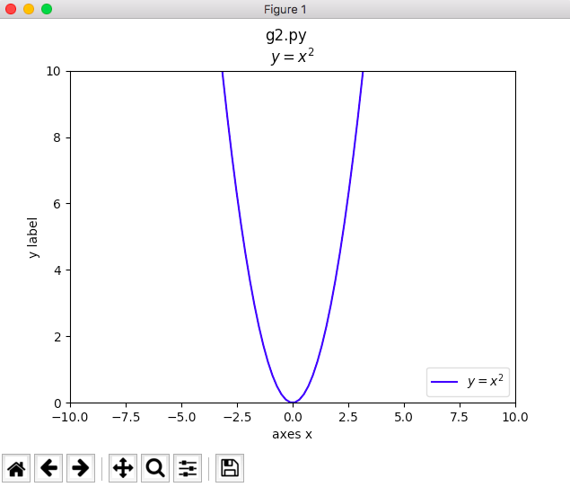

#### 【matplotlib】グラフの体裁
##### 前提
- <u> [【matplotlib】グラフを書く](./g1.md)</u>
---
##### 1. 体裁

```python
#!/usr/bin/env python
# -*- coding: utf-8 -*-
# g2.py

"""
matplotlib appearance
"""
import numpy as np
import matplotlib.pyplot as plt

def makeGraph():
    x = np.linspace(-10, 10, 100)
    return x, x**2

def makeFigure():
    fig = plt.figure()

    # figure() のタイトル
    fig.suptitle("g2.py")

    return fig

def makeAxes(fig):
    ax = fig.add_subplot(1,1,1)

    # グラフ・色・凡例
    x, y = makeGraph()
    ax.plot(x, y, color='b', label='$y=x^2$')

    # 凡例を表示
    ax.legend(loc='lower right')

    # axesタイトル
    ax.set_title("$y=x^2$")

    # x軸, y軸
    ax.set_xlabel("axes x")
    ax.set_ylabel("y label")

    # グラフの表示範囲（定義域、値域）
    ax.set_xlim([-10.0, 10.0])
    ax.set_ylim([0.0, 10.0])

    return ax

if __name__ == "__main__":

    makeAxes(makeFigure())
    plt.show()
```



<br>

参考リンク：<br>
- <u>[matplotlib.pyplot](https://matplotlib.org/devdocs/api/pyplot_summary.html)</u>
- <u>[matplotlib.figure.Figure](https://matplotlib.org/devdocs/api/_as_gen/matplotlib.figure.Figure.html#matplotlib.figure.Figure)</u>
- <u>[Axes class](https://matplotlib.org/api/axes_api.html)</u>
---
2017.10.22 初稿
