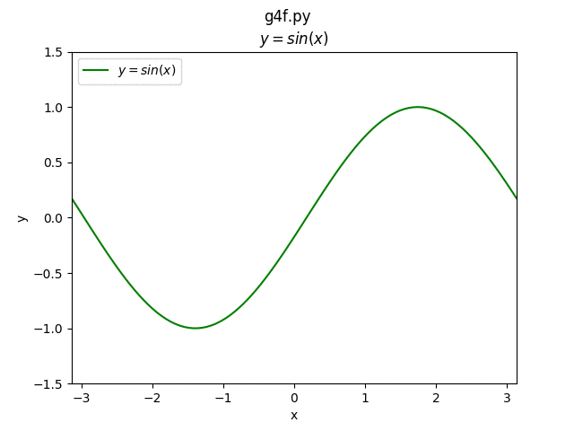
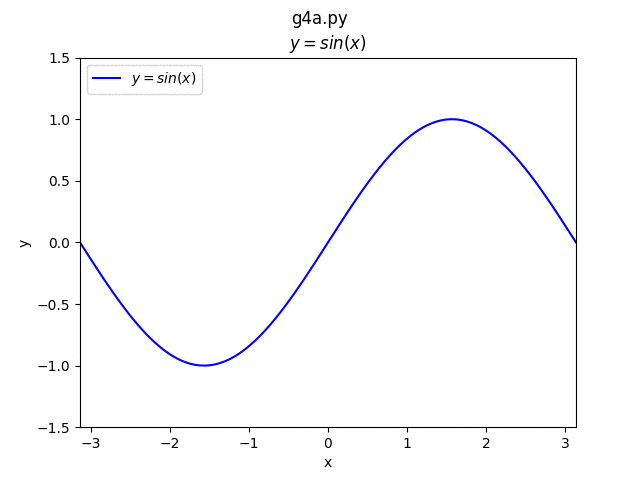

#### 【matplotlib】アニメーション
##### 前提
- <u> [【matplotlib】グラフを書く](./g1.md)</u>
---

##### 1. アニメーションの作成

The easiest way to make a live animation in matplotlib is to use one of the Animation classes.    

|メソッド名|説明|サンプルソース|
|:-|:-|:-:|
|FuncAnimation|Makes an animation by repeatedly calling a function func.|g4f.py|
|ArtistAnimation|Animation using a fixed set of Artist objects.|g4a.py|

<br>
どちらも結果的には同じような表示が可能だが、それぞれのコーディングの特徴によってメソッドを選択するのが良さそう。
<br>
<br>

  




##### 2. gif での保存について

###### 2-1. imagemagick のインストール

```
# brew install imagemagic
```

###### 2-2. matplotlibrc の編集
- 場所の確認
```python
>>> import matplotlib
>>> matplotlib.matplotlib_fname()
```

- 編集

  matplotlibrcの最終行に以下を追加
```matplotlibrc
animation.convert_path: /usr/local/Cellar/imagemagick/7.0.7-7/bin/magick
```

###### 2-3. 保存

```python
ani = animation.FuncAnimation(fig, makeGraph, interval=100)
ani.save(gifname, writer='imagemagick')
```
または
```python
ani = animation.ArtistAnimation(fig, ims, interval=100)
ani.save(gifname, writer='imagemagick')
```

参考リンク：<br>
- <u>[animation module](https://matplotlib.org/api/animation_api.html)
- <u>[matplotlib のanimation を保存](http://cartman0.hatenablog.com/entry/2016/05/04/200704)</u>
---
2017.10.22 初稿
